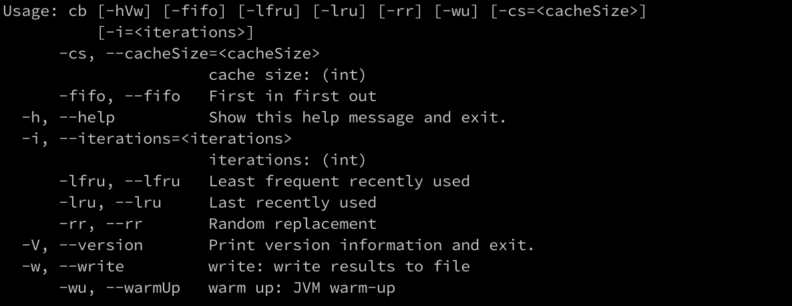

# cache-benchmark

## Usage

- `./gradlew run --args="--help"`

## Example

- `./gradlew run --args="-fifo -lru -lfru -rr -cs 1000 -i 5000 -w -wu"`

| Cache policy | Cache size | Iterations | Hit count | Hit ratio (%) | Evictions | Read (avg) (ns) | Cache (avg) read (ns) | Repo (avg) read (ns) |
|--------------|------------|------------|-----------|---------------|-----------|-----------------|-----------------------|----------------------|
| FIFO         | 1000       | 5000       | 1374      | 27            | 2626      | 2874129         | 2197                  | 3951066              |
| LRU          | 1000       | 5000       | 1798      | 35            | 2202      | 2829732         | 12952                 | 4388658              |
| LFRU         | 1000       | 5000       | 3238      | 64            | 48        | 1793968         | 13866                 | 3938957              |
| RR           | 1000       | 5000       | 1982      | 39            | 2018      | 2385954         | 1434                  | 3937758              |

with `-w` option results are saved to file in `project_root/output` directory